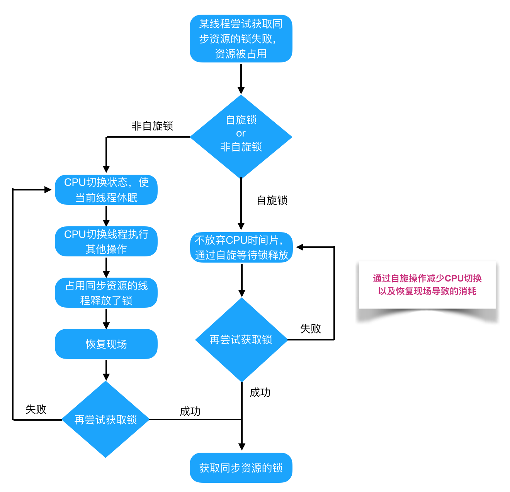
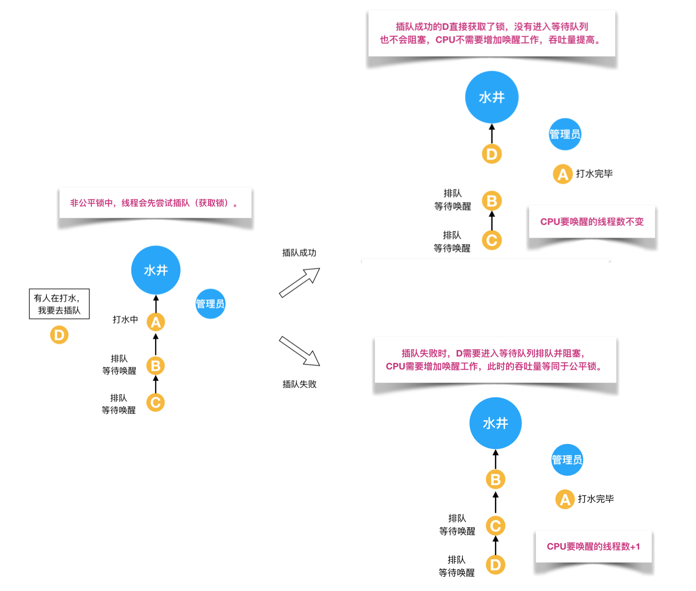

## java 基础

##### JVM

###### JVM 内存模型


- 程序计数器

  ```
  一块较小的内存空间，当前线程所执行的字节码的行号指示器。
  当前线程执行的是：
  Java方法，计数器记录的就是当前线程正在执行的字节码指令的地址。
  本地方法，那么程序计数器值为undefined。

  两个作用：
  1.改变程序计数器来读取指令，实现代码流程控制,如:顺序执行、选择、循环、异常处理。
  2.多线程情况下，记录当前线程执行位置，当线程切换回来的时候知道该线程上次运行到哪了。

  特点：
  线程私有，每条线程一个独立的程序计数器，生命周期随着线程创建而创建，随着线程结束而死亡。
  唯一一个不会出现OOM的内存区域。
  ```

- Java 虚拟机栈

  ```
  描述的是 Java方法执行的内存模型,虚拟机栈会为每一个即将运行的Java方法创建“栈帧”, 每个方法从开始调用到执行完成的过程，就是栈帧从入栈到出栈的过程。
  栈帧用于存储方法在运行过程中需要的一些信息，包括：
  局部变量表--存放方法参数和局部变量
  操作栈--在方法执行过程中，会有各种指令往栈中写入和提取信息
  动态链接--每个栈帧包含一个在常量池中对当前方法的引用,用于支持动态链接
  方法返回地址。

  特点：
  线程私有，每个线程都有各自的Java虚拟机。
  局部变量表随着栈帧创建而创建，表大小编译期确定,方法运行中,表大小不会改变。
  会出现两种异常：
  StackOverFlowError(栈溢出),虚拟机栈的内存大小不允许动态扩展,线程请求栈的深度超过虚拟机允许的最大深度(但内存空间可能还有很多),例如不断递归调用函数。
  OutOfMemoryError(内存溢出),虚拟机栈的内存大小允许动态扩展,当线程请求栈时内存用完了,无法再动态扩展,例如不断新建新线程。

  ```

- 本地方法栈

  ```
  与Java虚拟机栈实现的功能和抛出异常几乎相同,也是线程私有的, 只不过本地方法栈为Native方法服务。例如System.currentTimeMillis()
  ```

- 堆


```
Java虚拟机所需要管理的内存中最大的一块，主要存放对象实例。
线程共享，整个Java虚拟机只有一个堆，所有线程都访问同一个堆，在虚拟机启动时创建。

堆内存物理上不一定要连续，逻辑上连续即可。
堆是垃圾回收的主要区域，所以也被称为GC堆。

堆的大小可以固定也可以扩展，通过设置JVM运行参数调整初始值和最大值。
	-Xms -Xmx，其中-X表示它是JVM运行参数
	ms是memorystart的简称 最小堆容量
	mx是memory max的简称 最大堆容量
	一般设置成一样大小，避免GC后调整堆大小时的压力。

堆分成两大块:新生代和老年代
对象产生之初在新生代，步入暮年时进入老年代，但是老年代也接纳在新生代无法容纳的超大对象。

新生代= 1个Eden区+ 2个Survivor区
1.绝大部分对象在Eden区生成，当Eden区装填满的时候，会触发Young GC。
2.垃圾回收的时候，在Eden区实现清除策略，没有被引用的对象则直接回收。依然存活的对象会被移送到Survivor区。
3.Survivor 区分为S0和S1两块内存空间，每次Young GC的时候，将存活的对象复制到未使用的那块空间，然后将当前正在使用的空间完全清除，交换两块空间的使用状态。
4.如果YGC要移送的对象大于Survivor区容量上限，则直接移交给老年代。
5.每个对象都有一个计数器，每次YGC都会加1。默认值是15，可以在Survivor 区交换14次之后，晋升至老年代。(可以设置JVM参数-XX:MaxTenuringThreshold调整阀值)

```

- 方法区

```
存放已被虚拟机加载的类信息、常量、静态变量，也就是编译器编译后的代码等数据。
特点：
线程共享，整个虚拟机只有一个方法区。
方法区中的信息一般需要长期存在，JDK1.7前放在堆中作为永生代，1.8作为元空间放在直接内存中。
```

- 运行时常量池

```
方法区的一部分,存放编译期生成的各种字面量与符号引用。
```

- 直接内存

```
使用Native函数库直接分配堆外内存,然后通过一个存储在堆里的DirectByteBuffer对象作为这块内存的引用来操作堆外内存中的数据。
```

- 元空间

```
在JDK8里，区别于永久代，元空间在本地内存中分配。
字符串常量移至堆内存。
其他内容包括类元信息、字段、静态属性、方法、常量等都移动至元空间。
```

###### 如何确定某个对象是“垃圾”

- 引用计数法

  ```
  在对象中添加一个引用计数器，每当有一个地方引用它时计数器就加 1，当引用失效时计数器减1。当计数器为0的时候，表示当前对象可以被回收。
  优点：原理简单，判断起来很高效。
  缺点：1.被引用和引用清除时，都需要进行计数器的加减法操作，会带来性能损耗
  	 2.两个对象相互引用时，也就是循环依赖时无法回收。
  ```

- 可达分析法

  ```
  通过一系列的“GC Root”对象作为起点进行搜索，从这些节点开始向下搜索，搜索所走过的路径称为引用链，当一个对象到GC Roots没有任何引用链相连时，证明该对象不可用，一个对象经过两次标记过程都判定为不可用，那就判定为可回收对象。
  可作为GC Root的对象：虚拟机栈中引用的对象（如被调用的方法中使用到的参数、局部变量、临时变量等）、方法区静态属性引用的对象（如Java类的引用类型静态变量）、方法区常量引用的对象（如字符串常量池的引用）...
  ```

###### 垃圾回收方式

- 标记-清除算法

  ```
  将垃圾回收分为2个阶段，标记和清除，标记阶段标记出所有需要被回收的对象，清除阶段就是回收被标记对象所占用的空间。
  优点：实现起来比较容易。
  缺点：如果堆中大量对象都需要被回收，需要进行大量标记和清除动作，导致执行效率降低。
       容易产生内存碎片，碎片太多可能会导致后续为大对象分配空间时，无法找到足够空间，提前触发新的垃圾回收动作。
  使用场景：对象存活率高，更多用于老年代中。
  ```

- 复制算法

  ```
  1.将内存分为大小相同的两块,每次使用其中的一块。
  2.当这一块内存使用完后，就将还存活的对象复制到另一块去，再把使用的这块空间一次清理掉。
  优点：不容易出现内存碎片问题。
  缺点：只使用了一半内存，内存利用率比较低。
  	 如果对象存活率高，需要进行较多复制操作，效率会变低。
  使用场景：对象存活率比较低，更多用于新生代中。
  ```

- 标记-整理算法

  ```
  1.先对对象进行标记。
  2.让所有存活的对象向一端移动,然后直接清理掉存活端边界以外的内存空间。
  优点：不容易出现内存碎片问题，不会浪费内存空间。
  缺点：一方面要标记所有存活对象，还要对对象进行移动操作和更新引用地址操作，而且这种对象移动操作必须全程暂停用户应用线程才能进行,使用成本较大。
  使用场景：对象存活率高，更多用于老年代中。
  ```

- 分代收集算法

  ```
  1.新生代中,每次收集都会有大量对象死去,可以选择复制算法,只需要付出少量的对象复制成本就能完成垃圾收集。
  2.老年代中，对象存活率高，且没有额外的空间对它进行分配担保，所以选择标记清除或标记整理算法。
  ```

###### 垃圾回收器(G1--CMS 对比)

```
CMS收集器是一种以获取最短回收停顿时间为目标的收集器,基于"标记-清除"算法实现。
收集过程:
1)初始标记：独占CPU，stop-the-world，仅标记GCroots能直接关联的对象,速度比较快
2)并发标记: 可以和用户线程并行执行,标记所有可达对象
3)重新标记: 独占CPU，stop-the-world，对并发阶段用户线程运行产生的垃圾进行标记，更新逃逸垃圾对象。
4)并发清除：可以和用户线程并行执行，清理在重复标记中被标记为可回收的对象。
优点:并发收集、低停顿。
缺点：对CPU资源敏感，并发阶段不会导致用户线程停顿，但是会占用一部分线程，如果CPU资源不	  足的情况会有明显的卡顿。
	 无法处理浮动垃圾，在执行并发清理时，用户线程同时会产生一部分可回收对象，这部分垃圾是在标记之后，只能等下一次GC时清理掉。
	 容易出现大量空间碎片，如果不足以提供整块连续的空间给新对象时，会提前触发一次FullGC。
使用场景：
	在老年代并不频繁GC的场景下，是比较适用的。
```

```
G1(Garbage First)收集器区别与原有的分代模型，它将堆内存划分成大小相等的多个独立区域（每个分区都有一个身份，可能eden、survivor、old，是可以变化的），回收时计算出每个区域回收所获得的空间以及所需时间, 根据记录两个值判断哪个区域最具有回收价值,优先回收垃圾对象多的分区。G1可以通过控制回收的分区数量来控制STW的时间，已达到STW时间可控制。

G1在运行过程中的主要模式:YGC、并发阶段、混合模式、Full GC
1)YGC：对所有的新生代都进行GC
2)并发阶段：全局并发标记阶段。
3)混合模式：MIXedGC，先执行YGC，对回收性价比比较高的进行回收
4)Full GC，并不属于G1，在极端情况下，Mixed跟不上速度，只能被迫调用FullGC

相对于CMS：
1)在压缩空间方面有优势,CMS-标记清除算法,内存碎片多,G1用的是复制算法,直接清除原空间,通过将内存空间分成区域的方式避免内存碎片问题。
2)eden、survivor、old区不在固定，内存使用效率上来更灵活,哪个区域不够开辟哪个空间。
3)可以通过设置预期停顿时间来控制垃圾收集时间
4)G1能够在年轻代使用,CMS只在老年代使用。
```


## 集合框架

###### ArrayList 和 LinkedList(初始化过程,组成,底层结构,算法,线程是否安全)

###### HashMap(组成、寻找算法、扩容算法、put get 过程，红黑树二叉树 B+树区别)

- 组成


```
1)HashMap也是Hash表的一种实现,根据关键码直接进行访问的数据结构。采用一个映射函数将元素的关键字映射到表中的存储位置,查找元素时,可以直接根据关键字和映射关系计算出该元素在表中的存储位置.(这个计算出来的地址不是实际物理地址,称为Hash地址)，通常采用数组结构来实现，Java中采用了数组+链表+红黑树的数据结构实现。
2)从源码可知,HashMap类中一个字段Node[] table,Node实现了Map.Entry接口,本质就是一个键值对, 这个数组就是哈希桶数组.
3)默认构造函数会对哈希表的长度,负载因子,最大容纳数据量和实际存在的键值对数量进行初始化,默认初始化长度是16,默认负载因子是0.75,最大容纳数据量=长度*负载因子.
4)添加的每一个元素,先通过Hash算法计算关键码得到数组下标,也就是这个元素的存储位置,如果两个元素定位到相同的位置,表示发生了Hash碰撞,一般可以采用开放定址和链地址法来解决冲突,Java中HashMap采用了链地址法.
开放定址:当发生地址冲突后，求解下一个地址用。
链地址法:数组+链表,有冲突就把数据放在对应数组下标元素的链表上。
6)元素数目超过最大允许数目就重新扩容，扩容后的哈希桶数组长度是之前长度的两倍。
```

- key 获取哈希桶数组索引位置(寻找算法)


```
1)取key的HashCode值,通过hashCode()方法,将对象相关信息(存储地址,字段等)映射成一个数值.
2)高位运算,通过HashCode值的高16位异或低16位实现的：(h = k.hashCode()) ^ (h >>> 16),这么做可以在数组的length比较小的时候,也能保证考虑到高低Bit参与到Hash运算中,同时不会有太大开销.
3)取模运算,通过h&(length-1)的到元素的保存位置，底层数组的长度总是2的n次方，h&(length-1)运算等价于对length取模,也就是h%length,但是&比%效率更高.
```

- put 方法执行过程


- 扩容过程


```
1)当元素的实际数量size超过最大允许数目时进行扩容,用一个2倍长度的数组代替已有的容量小的数组,将原有数组的元素拷贝到新的数组中。
2)扩容后的元素位置要么是在原位置，要么在原位置再移动2次幂位置。
3)因为length变成2倍，length-1相对于之前在高位多了1bit,不需要重新计算元素的hash值,只需要看看原来的hash值，相对于length-1高位多了1bit的位置是1还是0，是0的索引没变，是1的话索引变成"原索引+oldCap(数组长度)"
```

###### 为什么使用红黑树,不使用其他二叉树

```
1)普通二叉树和二叉搜索树都可以退化成单链表形式,查找效率过低。
2)AVL树和红黑树都是平衡二叉树,查找、删除、修改时间复杂度都是O(logn)。
3)AVL树是严格平衡,从根到任何叶子的最短路径和最长路径差异最多为1;红黑树中差异可以是2倍。AVL树在查找密集型任务上会更快。
3)主要区别在于添加/删除操作时完成的旋转操作次数,平衡AVL树可能需要O(logn)次旋转,红黑树最多需要两次旋转。红黑树更适合插入修改密集型任务。
```

## 多线程与并发

###### 线程实现

```
1.实现Runnable接口,实现run()方法,将实现类对象作为Thread类的构造函数参数创建Thread对象,调用start()方法启动线程。
2.继承Thread类,重新run()方法，通过Thread类的start()实例方法开启新线程。
3.实现Callable接口通过FutureTask包装器来创建线程。
4.线程池
```

###### 线程状态


```
New：新创建的线程，尚未执行；
Runnable：运行中的线程，正在执行run()方法的Java代码；
Blocked：运行中的线程，因为某些操作被阻塞而挂起；
Waiting：运行中的线程，因为某些操作在等待中；
Timed Waiting：运行中的线程，因为执行sleep()方法正在计时等待；
Terminated：线程已终止，因为run()方法执行完毕。
```

###### 线程死锁

```
多个线程互相持有对方需要的资源导致同时阻塞。
必要条件: 该资源任意一个时刻只由一个线程占用。
		 一个线程因请求阻塞时，不会释放已获得的资源。
		 线程已获得的资源未使用完前，不能被剥夺，只能由自己释放。
如何避免: 一次性申请所有的资源。
		 线程申请其他资源时，如果申请不到，可以主动释放它占用的资源。
如何解除: 强制杀死某些线程直到死锁解除为止。
```

###### sleep()和 wait()区别

```
1.sleep()不会释放锁,Thread的静态方法;wait()为释放锁,是Object的方法.
2.sleep()会自动苏醒;wait()设置时间的话,超时后线程自动苏醒;或者其他线程调用同一个对象上的notify()或notifyAll()方法.
3.sleep()和wait()都不会占用cpu资源.
```

###### volatile

```
volatile是一个轻量级的同步机制,主要是保证内存的可见性，即当一个线程修改的共享变量时，另一个线程可以读取到共享变量被修改后的值。
```

###### volatile、synchronized 的区别

```
1. volatile主要是保证内存的可见性,synchronized主要是解决多个线程访问资源的同步性。
2. volatile作用与变量，synchronized作用于代码块或者方法。
3. volatile不能保证数据的原子性，synchronized可以保证数据的可见性和原子性。
4. volatile不会造成线程的阻塞，synchronized会造成线程的阻塞。
```

###### synchronized 关键字

```
synchronized关键字保证修饰的代码块和方法同一时间只有一个线程在执行;
修饰静态方法和代码块都是对类的字节码对象加锁;
修饰实例方法是给this对象实例加锁。
```

##### 锁


###### AQS(AbstractQueuedSynchronizer) 实现

- AQS 是一种提供了原子式管理同步状态、阻塞和唤醒线程功能以及队列模型的简单框架。

###### 悲观锁与乐观锁


- 悲观锁：对于同一个数据的并发操作，悲观锁认为自己在使用数据的时候一定有别的线程来修改数据，因此在获取数据的时候会先加锁，确保数据不会被别的线程修改。Java 中，synchronized 关键字和 Lock 的实现类都是悲观锁。

- 乐观锁：认为自己在使用数据时不会有别的线程修改数据，所以不会添加锁，只会在最后更新数据时检查数据有没有被修改，没有当前线程将自己修改的数据写入。如果数据被其他线程更新了,根据不同的实现方式执行不同的操作(报错/自动重试)。

  ```
  CAS(Compare And Swap比较替换)算法，是一种无锁算法，不使用锁的情况下实现多线程之间的变量同步。涉及到三部分，需要读写的内存值+旧的预期值(比较值)+要写入的新值。只有当内存值与预期值相等时,通过原子方式(比较+更新整体是一个原子操作)用新值更新内存值,否则不会执行任何操作。一般情况，更新是一个不断重试的操作。
  ```

- CAS 三大问题：

  ```
  1.ABA问题：内存值本来是A，变成了B，又变成了A，CAS检查不出来变化。解决思路就是在变量前面添加版本号，每次更新变量时都把版本号加一。
  2.循环时间长开销大：操作长时间不成功，会导致其一直自旋，给CPU带来很大开销。
  3.只能保证一个共享变量的原子操作：对于一个共享变量，CAS能保证原子操作，但是对于多个共享变量，CAS无法保证操作原子性。解决使用AtomicReference类来保证引用对象之间的原子性，可以把多个变量放在一个对象里来进行CAS操作。
  ```

- 使用场景：悲观锁适用于写多读少的场景，先加锁保证写操作数据正确。

   乐观锁适用于读多写少的场景，不加锁能够使读操作性能提升。

###### 自旋锁与适应性自旋锁



- 自旋锁：阻塞或唤醒一个 Java 线程需要操作系统切换 CPU 状态来完成，这种状态转换需要耗费处理器时间。如果同步代码块中的内容过于简单，状态转换消耗的时间有可能比用户代码执行的时间还要长。获取锁失败时让线程自旋等待锁释放，直到锁释放后获取锁成功，直接获取同步资源，避免切换线程的开销，这就是自旋锁。

  缺点：如果锁占用时间过长，自旋占用处理器时间，白白浪费处理器资源。一般来说自旋超过了限定次数，没有成功获得锁，就直接挂起线程。

- 适应性自旋锁：自旋的次数是根据前一次在同一个锁上的自旋时间决定；对于某个锁，自旋刚刚成功获得锁，就运行延迟自旋时间；如果自旋很少成功获得过，那在以后尝试获取这个锁时将可能省略掉自旋过程，直接阻塞线程。

###### 公平锁/非公平锁

- 公平锁：多个线程按申请锁的顺序来获取锁，线程直接进入队列中排队，队列第一个线程才能获得锁。

  

- 非公平锁：是多个线程直接尝试获取锁，获取不到才会等待队列的队尾等待。

  

###### 可重入锁(递归锁)与非可重入锁

- 可重入锁：是指同一个线程在外层方法获取锁的时候，再进入该线程的内层方法会自动获取锁(前提锁对象是同一个对象或者 class 对象)

  

- 不可重入锁：那么当前线程在调用内层方法之前，需要将执行外层方法时获取的(当前对象的)锁释放掉，实际上该对象锁已被当前线程所持有，且无法释放，所以此时会出现死锁。

  

###### 独占锁与共享锁

- 独占锁(排他锁)：是指该锁一次只能被一个线程所持有。如果一个线程对数据加上排他锁后，其他线程不能再加任何类型的锁；获得排他锁的线程可以读写数据。
- 共享锁：是指该锁可被多个线程锁持有。如果一个线程对数据加上共享锁后，其他线程也只能加共享锁；获得共享锁的线程只能读数据，不能修改。

###### synchronized 和 lock 区别

- synchronized 是关键字；lock 是一个接口，实现类进行锁操作。
- synchronized 无法判断锁的状态；lock 可以判断是否获得锁 lock.tryLock()。
- synchronized 自动释放锁，lock 手动释放 lock.unlock()；前者阻塞后，其他线程一直等待，lock 有超时时间。
- synchronized 是非公平锁；lock，默认非公平锁，可以设置为公平锁。

### ThreadLocal

###### 4 大引用类型

###### 堆内存泄露使用

###### 实际使用场景

##### 线程池

###### 线程池是什么

线程池是一种将线程资源统一在一起管理的工具。线程创建销毁、调度都会带来开销，线程池维护多个线程，等待分配并发执行的任务。一方面避免处理任务时频繁创建和销毁线程的开销，另一方面是避免线程数量过多导致资源耗尽的风险以及调度问题。

好处：降低资源消耗、提高响应速度、提高线程的可管理性。

###### 线程池解决的问题是什么

核心问题是线程资源管理问题，并发环境下，系统不能确定在任意时刻，有多少任务要执行，有多少线程资源要投入。会带来以下问题：频繁申请/销毁资源和调度资源，带来的消耗可能会非常大。资源无限申请，会引发系统资源耗尽的风险。系统无法合理管理内部的线程资源分布，会降低系统稳定性。

##### 核心设计与实现

###### 总体设计


```
顶层接口Executor：将任务提交与任务执行进行解耦。用户只需要提供Runnable对象，将任务运行逻辑提交到执行器中，由Executor框架完成线程的调配和任务的执行部分。
ExecutorService接口：(1)扩充执行任务的能力,提供为一个或一批异步任务生成Future的方法。(2)提供了管控线程池的方法,比如停止线程池的运行。
AbstractExecutorService抽象类：将执行任务的流程串联起来，保证下层实现只需关注一个执行任务的方法。
ThreadPoolExecutor实现类：实现最复杂的运行部分，一方面维护自身生命周期，另一方面同时管理线程和任务。
```

###### 运行机制


```
线程池内部实际是构建了一个生产者消费者模型，运行机制主要分成两个部分：任务管理、线程管理。
任务管理充当生产者角色：任务提交后，线程池会判断任务后续流转，(1)直接申请线程执行该任务;(2)缓冲到队列中等待线程执行;(3)拒绝该任务。
线程管理部分是消费者：根据任务请求分配线程,执行完任务后会继续获取新的任务去执行，当线程获取不到任务时，就会被回收。

```

###### 生命周期管理

- 内部使用一个 AtomicInteger 类型的变量维护两个值：运行状态(runState)和线程数量(workerCount)，高 3 位保存运行状态，低 29 位保存线程数量。

- 5 种运行状态

  

- 生命周期转换如下

  

###### 任务执行机制

- 任务调度

  

- 任务缓冲

  线程池中是生产者消费者模式，通过一个阻塞队列来实现。阻塞队列缓存任务，工作线程从阻塞队列中获取任务。

  

  

- 任务申请

  

- 任务拒绝

  线程池有一个最大容量，当线程池的任务缓存队列已满，并且线程数目已经达到最大线程数目时，就要拒绝掉该任务。

  可以实现 RejectedExecutionHandler 定制拒绝策略，或者选择 JDK 提供 4 种已有策略

  

###### Worker 线程管理

- Worker 线程增加
- Worker 线程回收
- Worker 线程执行任务

###### 构造参数 7 个

- **核心线程数**corePoolSize

- **最大线程数**maxmumPoolSize

- 多余线程存活时长 keepAliveTime

  (超过核心线程数的线程还没有接受到新的任务，那就回收)

- 时间单位 unit

- **任务缓冲队列**workQueue

- 线程工厂 threadFactory

  (用来创建线程工厂, 比如里面可以自定义线程名称)

- 任务拒绝策略 handler

###### 实际使用场景,参数配置

- CPU 密集型：也叫计算密集型，以大量计算为主的任务，主要靠 CPU 运算能力，相对来说花在磁盘、内存 IO 上的时间较少，比如计算圆周率、视频解码。这种任务也可并行计算，但是一般核心线程数设置为 CPU 核心数+1，线程数超过 CPU 核心数量太多，频繁切换线程也有开销，反而使任务效率下降。

- IO 密集型：涉及到网络、磁盘 IO 的任务，这类任务 CPU 消耗很少，主要是在等待 IO 操作，比如数据库读写，网络传输。这种任务并行计算，一般线程数等于任务数最好。

- **动态化参数配置**：

  ```
  1.简化线程池配置，线程池构造参数中最核心的是3个，核心线程数，最大线程数，任务缓存队列容量。实际应用需要并发性的场景主要是两种:(1)并行执行子任务,提高响应速度(商品相关信息整合加载)。这种情况下不需要缓冲任务，应该立即执行。(2)并行执行大批次任务,提升吞吐量。这种情况应该使用有界队列，使用队列去缓冲大批量任务，队列容量必须声明，防止任务无限制堆积。
  2.参数可动态修改，JDK原生线程池提供了几个公共的set方法，在运行期设置核心线程数、最大线程数，会直接覆盖原来的值。默认提供的队列的容量字段被final修饰,无法修改,可以自定义一个队列,让它可以修改容量参数即可。
  3.增加线程池监控。
  ```


## IO/NIO/AIO

> IO框架知识体系


#### IO理解入门

##### IO理解分类(传输、操作)

###### 传输方式

* 字节流

  读取单个字节，用来处理二进制文件。

* 字符流

  读取单个字符(一个字符根据编码不同，对应的字节也不同)，用来处理文本文件。

* 字节转字符

  编码就是把字符转换为字节，解码是把字节重新组合成字符。如果编码和解码过程使用不同的编码方式那么就出现了乱码。

  ```
  GBK编码，中文字符占两个字节，英文字符占1个字节；
  UTF-8编码，中文字符占3个字节，英文字符占1个字节；
  ```

###### 数据操作

* 磁盘操作(file)

  FileInputStream、FileOutputStream、FileReader、FileWriter

  ```java
  public static void listAllFiles(File dir) {
      if (dir == null || !dir.exists()) {
          return;
      }
      if (dir.isFile()) {
          System.out.println(dir.getName());
          return;
      }
      for (File file : dir.listFiles()) {
          listAllFiles(file);
      }
  }
  ```

* 字节/字符操作

  字节数组(byte[]): ByteArrayInputStream、ByteArrayOutputStream

  字符数组(char[]): CharArrayReader、CharArrayWriter

  ```java
  public static void copyFile(String src, String dist) throws IOException {
  
      FileInputStream in = new FileInputStream(src);
      FileOutputStream out = new FileOutputStream(dist);
      byte[] buffer = new byte[20 * 1024];
  
      // read() 最多读取 buffer.length 个字节
      // 返回的是实际读取的个数
      // 返回 -1 的时候表示读到 eof，即文件尾
      while (in.read(buffer, 0, buffer.length) != -1) {
          out.write(buffer);
      }
  
      in.close();
      out.close();
      
      FileReader fileReader = new FileReader(filePath);
      BufferedReader bufferedReader = new BufferedReader(fileReader);
  
      String line;
      while ((line = bufferedReader.readLine()) != null) {
          System.out.println(line);
      }
  
      // 装饰者模式使得 BufferedReader 组合了一个 Reader 对象
      // 在调用 BufferedReader 的 close() 方法时会去调用 Reader 的 close() 方法
      // 因此只要一个 close() 调用即可
      bufferedReader.close();
  }
  ```

* 管道操作

  PipedInputStream、PipedOutputStream、PipedReader、PipedWriter

* 基本数据类型

  DataInputStream、DataOutputStream

* 缓冲操作

  BufferedInputStream、BufferedOutputStream、BufferedReader、BufferedWriter

* 打印

  PrintStream、PrintWriter

* 对象序列化反序列化

  ObjectInputStream、ObjectOutputStream

  序列化的类需要实现Serializable接口;

  transient 关键字可以使一些属性不会被序列化。

  ```java
  public static void main(String[] args) throws IOException, ClassNotFoundException {
      A a1 = new A(123, "abc");
      String objectFile = "file/a1";
      ObjectOutputStream objectOutputStream = new ObjectOutputStream(new FileOutputStream(objectFile));
      objectOutputStream.writeObject(a1);
      objectOutputStream.close();
  
      ObjectInputStream objectInputStream = new ObjectInputStream(new FileInputStream(objectFile));
      A a2 = (A) objectInputStream.readObject();
      objectInputStream.close();
      System.out.println(a2);
  }
  
  private static class A implements Serializable {
      private int x;
      private String y;
  
      A(int x, String y) {
          this.x = x;
          this.y = y;
      }
  
      @Override
      public String toString() {
          return "x = " + x + "  " + "y = " + y;
      }
  }
  ```

* 转换

  InputStreamReader、OutputStreamWriter

##### IO设计模式

###### Java-IO装饰者模式

以InputStream抽象类为例：


```java
InputStream是抽象组件；
FileInputStream是InputStream的子类，属于具体组件，提供了字节流的输入操作；
FilterInputStream属于抽象装饰者，用于装饰组件，为组件提供额外功能；
BufferedInputStream属于具体装饰者，额外提供了缓存的功能。

例如实例化一个具有缓存功能的字节流对象：
FileInputStream fileInputStream = new FileInputStream(filePath);
BufferedInputStream bufferedInputStream = new BufferedInputStream(fileInputStream);

```

##### Java-IO源码

* InputStream
* OutputStream

#### IO基础知识与概念

##### IO概念介绍

在计算机操作系统中，IO就是**输入**和**输出**，也就是**读**和**写**操作，针对不同的对象，IO模式划分为磁盘IO模型和网络IO模型。

IO操作会涉及到**用户空间**和**内核空间**的转换：

* 内存空间分为内核空间(用户缓冲区)和用户空间(内核缓冲区)。
* 用户的应用程序不能直接操作内核空间，需要将数据从内核空间拷贝的用户空间才能使用。
* 无论是read操作，还是write操作，都只能在内核空间里执行。
* 磁盘IO和网络IO请求加载到内存的数据都是先放在内核空间。
* 读操作，操作系统先检查内核缓冲区有无需要的数据，有则直接copy到用户缓冲区。没有，对于磁盘IO直接从磁盘读取到内核缓冲区；对于网络IO，从Socket协议中读取客户端发送的数据到内核空间，然后把内核空间数据copy到用户空间，供应用程序使用。
* 写操作，**用户的应用程序将数据从用户空间copy到内核空间，此时对于用户程序来说，写操作已经完成**，后续由操作系统决定什么时候再写到磁盘或者通过网络发送出去。（除非应用程序调用sync命令，立即将数据写入磁盘，或执行flush()方法，通过网络把数据发送出去。)

##### 用户空间&内核空间

虚拟内存被操作系统划分成两块，物理内存不划分，逻辑上虚拟划分。**内核空间** 是操作系统 **内核代码运行的地方**，**用户空间** 是 **用户程序代码运行的地方**。当应用进程执行系统调用陷入内核代码中执行时就处于**内核态**，当应用进程在运行用户代码时就处于**用户态**。

##### IO设备与内存数据传输方式

###### PIO


磁盘和内存之间的数据传输需要CPU控制，读取磁盘文件到内存中，数据要经过CPU存储转发。这种方式需要占用CPU时间读取文件，效率太低，已经几乎不用了。

###### DMA(Direct Memory Access)


1. 用户进程通过read等系统调用接口想操作系统(CPU)发出IO请求，然后进程进入阻塞状态。
2. CPU收到用户进程请求后，将IO请求发送给MDA，然后CPU就可以干其他事了。
3. DMA将IO请求转发给磁盘。
4. 磁盘驱动器收到内核IO请求后，把数据读取到自己的缓冲区中，读满后向DMA发起中断信号。
5. DMA收到磁盘已满的信号，将磁盘缓冲区的数据copy到内核缓冲区。(不占用CPU)
6. 如果内核缓冲区数据少于用户申请读的数据，DMA继续向磁盘发IO请求，直到数据符合用户要求为止。
7. 内核缓冲区数据已经符合用户要求，DMA停止向磁盘发IO请求。
8. DMA发送中断信号给CPU。
9. CPU收到数据已准备好信号，将数据从内核空间copy到用户空间，系统调用接口返回。
10. 用户进程读取到数据后继续执行原来的任务。

DMA可以不经过CPU直接进行磁盘和内存的数据交换。DMA控制器承担的是磁盘缓冲区到内核缓冲区，或网卡设备到内核之间的拷贝工作。内核缓冲区到用户缓冲区之间的拷贝工作还是CPU负责。这样很大程度降低了CPU占用率。

##### 缓冲IO和直接IO

###### 缓冲IO

缓存IO也被称为标准IO，大多数文件系统默认以缓冲IO方式工作。磁盘中的数据通过DMA先拷贝到内核缓冲区，然后再从内核缓冲区拷贝到用户缓冲区。

`优点`：内核有缓存，可以减少读盘次数。

`缺点`：内核缓冲区和用户缓冲区之间需要进行多次数据拷贝操作，带来的CPU和内存开销比较大。

###### 直接IO

磁盘中的数据直接通过DMA拷贝到用户缓冲区。

`优点`：减少一次从内核缓冲区到用户缓冲区之间的数据复制操作。这种方式通常用在数据库、消息中间件中。

`缺点`：如果访问的数据不在应用缓冲区中，每次数据都会直接从磁盘进行加载。

##### IO访问方式

###### 磁盘IO


* 读操作，涉及到两次缓冲区copy，第一次磁盘缓冲区到内核缓冲区，第二次内核缓冲区到用户缓冲区。
* 写操作，涉及到四次缓冲区的copy，前两次是从磁盘缓冲区到内核缓冲区，再从内核缓冲区到用户缓冲区；后两次是从用户缓冲区到内核缓冲区，再从内核缓冲区到磁盘缓冲区。

磁盘IO的延时：寻道时间、旋转延迟时间、传输时间。

###### 网络IO


* 读操作，既可以从磁盘读数据，也可以从Socket中读数据(网卡中读取)。从Socket中读数据，应用程序会等待客户端发送数据，客户端未发送会阻塞，直到发送了数据被唤醒。
* 写操作，涉及到四次缓冲区的copy，前两次从磁盘缓冲区到内核缓冲区，再从内核缓冲区到用户缓冲区；后两次是从用户缓冲区到内核缓冲区，再从内核缓冲区到网卡设备。

网络IO主要延时是由：服务器响应延时+带宽限制+网络延时+跳转路由延时+本地接收延时决定。

##### 零拷贝IO

网络IO零拷贝传输过程：磁盘->内核缓冲区(快速拷贝到Kernal Socket buffer)->网卡设备。

1. 应用程序调用read()方法时，通过DMA方式将数据从磁盘拷贝到内核缓冲区。
2. 由CPU控制，将内核缓冲区的数据直接拷贝到另外一个与Socket相关的内核缓冲区，kernel socket buffer。
3. 由DMA把数据从kernel socket buffer直接拷贝给网卡设备。

只经历了三次缓冲区的拷贝，从磁盘缓冲区到内核缓冲区，再从内核缓冲区到kernel socket buffer，再从kernel socket buffer到网卡设备中。

只发生两次内核态和用户态的切换，第一次当应用程序调用read方法时，用户态切换到内核态执行read系统调用，第二次是系统调用返回，从内核态切换到用户态。

##### 同步&异步、阻塞&非阻塞

*注意这些概念讨论的上下文!!!*

* 在进程通信层面，阻塞/非阻塞，同步/异步基本是同义词，但是需要区分讨论的对象是发送放还是接收方。发送方阻塞/非阻塞（同步/异步）和接收方的阻塞/非阻塞（同步/异步） 是互不影响的。

* 在IO系统调用（ IO system call ）层面：

  阻塞I/O和非阻塞I/O区别是应用进程执行系统调用后是否立即返回；

  **同步I/O**：数据准备完后，数据从内核空间复制到用户空间的阶段，应用进程都是阻塞的。

  **异步I/O**：数据准备完后，由内核将数据拷贝到用户空间，完成后给应用进程发送一个信号，整个IO过程，应用进程完全没有被阻塞。

#### IO模型(Unix IO模型)

###### 阻塞IO模型(BIO)


应用进程执行系统调用后被阻塞，直到数据复制到应用进程缓冲区中才返回。

应用进程在阻塞过程中，不意味着整个操作系统都被阻塞，其他应用程序还可以执行，不消耗CPU时间，这种模型执行效率比较高。

###### 非阻塞IO模型(NIO)


应用进程执行系统调用后，内核返回一个错误码。应用进程可以继续执行，但是需要不断的执行系统调用来获知IO是否完成，也就是轮询(polling)。

多次执行系统调用，意味着CPU要处理更多的系统调用，这种模型比较低效。

###### IO复用模型


也称为事件驱动IO，基本原理就是有个函数不断地轮询所负责的所有socket，某个socket有数据到达了，就通知用户进程，这时用户进程再执行recvfrom系统调用，将数据从内核复制到应用进程。

优势在于可以同时处理多个连接，连接数不高不一定有多线程阻塞IO性能好。

###### 信号驱动I/O


应用进程执行系统调用会立即返回，应用进程可以继续执行，不会被阻塞，内核会在数据到达时向应用进程发送信号，之后应用进程执行recvfrom系统调用，将数据从内核复制到应用进程中。

###### 异步IO模型


应用进程执行系统调用会立即返回，应用进程可以继续执行，不会被阻塞，内核会在所有操作完成之后向应用进程发送信号。

#### Java-IO实现

##### BIO

##### NIO

###### 核心组成

* Buffer，一块缓存区，内部使用字节数组存储数据

  `内部维护变量`：
  mark：初始值为-1，用于备份当前的position
  position：初始值我0，表示当前可以写入或读取数据的位置，当读或写一个数据后，移动到下一个位置。
  limit：写模式，表示最多能往Buffer里写多少数据，等于capacity值；读模式，表示可以读取多少数据。
  capacity：缓存数组的大小。
  `常用函数`：
  flip()：Buffer有两种模式，写模式和读模式，flip后Buffer从写模式变成读模式
  clear()：一旦读完Buffer中的数据，需要让Buffer准备好再次被写入，clear会恢复状态值，但不会擦除数据。

  ```
  已知Buffer的实现类：
  ByteBuffer
  CharBuffer
  DoubleBuffer
  FloatBuffer
  IntBuffer
  LongBuffer
  ShortBuffer
  MappedByteBuffer
  ```

* ```
  
  已知Buffer实现类:
  ByteBuffer
  CharBuffer
  DoubleBuffer
  FloatBuffer
  IntBuffer
  LongBuffer
  ShortBuffer
  MappedByteBuffer
  ```

  

* Channel，NIO把支持的I/O对象抽象为通道，类似于原I/O中的流(Stream)，但有区别：

  流是单向的，通道是双向的，可读可写；

  流读写是阻塞的，通道可以异步读写；

  流中的数据可以选择先读到缓存中，通道的数据必须先读写到缓存中。

  ```
  已知Channel实现类:
  FileChannel
  ServerSocketChannel
  SocketChannel
  DatagramChannel
  ```

* Selector

##### IO多路复用

##### 异步IO(AIO)

#### IO框架之开源框架

##### NIO框架-Netty

## Spring系列

#### Spring相关

##### IOC

###### IOC(控制反转) 介绍

IOC即控制反转，不是一种技术，只是一种设计思想，将设计好的对象交给容器控制，而不是对象由直接控制。

有了IOC容器后，把创建和查找依赖对象的控制权交给了容器，由容器进行注入组合对象，而不是由对象主动去找，所以对象与对象之间的耦合度比较低。

###### IOC实现

DI依赖注入，是IOC(控制反转)的一种实现方式，组件之间的依赖关系由容器在运行期决定，由容器将依赖关系注入到组件中。对象通过配置需要的外部资源，由IOC容器把资源注入到对象中，不需要关系具体资源从哪来的。

###### IOC配置三种方式

* XML配置
* Java类配置
* 注解配置(@Component)

###### 依赖注入三种方式

* 构造方法注入
* setter注入
* 基于注解注入(@Autowied)

###### IOC初始化过程


###### 循环依赖问题

Spring为了解决单例的循环依赖问题，使用了三级缓存。

第一层缓存，单例对象缓存，存放已经实例化并且属性已赋值的对象。

第二层缓存，提前曝光单例对象缓存，存放已经实例化但是尚未填充属性和初始化的对象。仅仅作为指针提前曝光，被其他bean引用。

第三层缓存，提前曝光单例对象工厂缓存，将实例化后的bean提前曝光，转换成beanFactory放入缓存。

1. Spring 创建 bean 主要分为两个步骤，实例化bean 对象，接着去填充对象属性和初始化。
2. 每次创建 bean 之前，我们都会从缓存中查下有没有该 bean，因为是单例，只能有一个。
3. 当我们创建 beanA 的原始对象后，并把它放到三级缓存中，接下来就该填充对象属性了，这时候发现依赖了 beanB，接着就又去创建 beanB，同样的流程，创建完 beanB 填充属性时又发现它依赖了 beanA，又是同样的流程，不同的是，这时候可以在三级缓存中查到刚放进去的原始对象 beanA，所以不需要继续创建，用它注入 beanB，完成 beanB 的创建。
4. 既然 beanB 创建好了，所以 beanA 就可以完成填充属性的步骤了，接着执行剩下的逻辑，闭环完成。

##### AOP

###### AOP(面向切面编程) 介绍

AOP的本质也是为了解耦，它是一种设计思想。通过预编译方式和运行期间动态代理实现程序的统一维护。就是将分散在各个业务逻辑代码中相同的代码通过横向切割的方式抽取到一个独立的模块中。

`连接点`：在哪里干(哪些方法扩展)

`切入点`：在哪里干的集合

`通知`：干什么(增强的代码)

`切面`：在哪干和干什么集合

`目标对象`：对谁干(被增强的对象)

`织入`：怎么实现(怎么把切面连接到目标对象上)

###### AOP 实现

Spring AOP框架采用的是代理的方式，是在运行时动态将要增强的代码织入到目标类中。通过动态代理技术完成的，如Java JDK的动态代理(Proxy，底层通过反射实现)或者CGLIB的动态代理(底层通过继承实现)。

AspectJ是更强的AOP框架，使用静态织入的方式，也就是编译器织入，AspectJ的编译器先编译切面类，再在目标类编译时织入。

###### AOP配置方式

* XML配置
* @AspectJ注解方式

##### 事务

###### 事务的传播方式

##### 相关设计模式

* 工厂模式
* 单例模式 
* 适配器模式
* 装饰者模式
* 代理模式
* 模板方法模式

#### SpringBoot相关

##### SpringBoot 常用注解

###### Bean处理

@Component、@Controller、@Service、@Repository

@Resource、@Autowire

@Configuration

@Scope

###### Http请求

@GetMapping

@PostMapping

@PutMapping

@DeleteMapping

###### 前后端参数传递

@RequestBody

@RequestParam

@PathVariable

###### 读取配置

@Value

@ConfigurationProperties

@PropertySource

###### 参数校验(JSR303标准)

@NotNull

@NotEmpty

@NotBlank

@Valid(参数是对象)

@Validated(告诉Spring去校验方法参数

###### 统一异常处理

@ControllerAdvice

@ExceptionHandler

###### JPA数据持久化

@Entity

@Table

@Id

@Column

@Transient(指定不持久化特定字段)

@Transactional

###### JSON格式处理

@JsonIgnore

@JsonFormat

@DateTimeFormat

###### 测试处理

@ActiveProfiles(作用于测试类，声明生效的Spring配置文件)

@Test

###### 配置启动

@SpringBootApplication(等价于以下三个)

@Configuration

@EnableAutoConfiguration

@ComponentScan

##### SpringBoot启动流程

##### SpringBoot自动配置


## Mysql 相关

###### 数据库存储引擎

```
数据库存储引擎是数据库底层软件组织，数据库管理系统使用数据引擎进行创建、查询、更新和删除数据。不同的存储引擎提供不同的存储机制、索引技巧、锁定水平等功能。
```

###### innodb 和 myisam 存储引擎区别

- myisam 引擎是 5.1 版本之前的默认引擎，支持全文检索，但是不支持事务和行级锁，所以一般用于有大量查询少量插入的场景来使用，而且 myisam 不支持外键，并且索引和数据是分开存储的。
- innodb 是基于聚簇索引建立的，它支持事务、外键，并且通过 MVCC(**多版本并发控制**)来支持高并发，索引和数据存储在一起。

###### 数据库索引

```
数据库索引是一个单独存储在磁盘上的数据库结构, 包含对数据表里所有记录的引用指针。
按数据结构来说主要包含Hash索引和B+树索引。
```

###### 聚集索引/非聚集索引区别

###### 为什么不使用其他树，使用 B+树

###### 非聚集索引怎么才能不回表

###### 覆盖索引和回表。

```
覆盖索引指的是一次查询中，如果一个索引包含所有需要查询的字段的值，就称为覆盖索引，不需要在回表查询。
```

###### 执行计划 explain 参数

###### MVCC(**多版本并发控制**)

##### 事务

```sql
BEGIN 或 START TRANSACTION 显式地开启一个事务；
COMMIT / COMMIT WORK二者是等价的。提交事务，并使已对数据库进行的所有修改成为永久性的；
ROLLBACK / ROLLBACK WORK。回滚会结束用户的事务，并撤销正在进行的所有未提交的修改；
SAVEPOINT identifier 在事务中创建一个保存点，一个事务中可以有多个 SAVEPOINT；
RELEASE SAVEPOINT identifier 删除一个事务的保存点；
ROLLBACK TO identifier 把事务回滚到标记点；
SET TRANSACTION 用来设置事务的隔离级别。InnoDB 存储引擎提供事务的隔离级别有READ UNCOMMITTED、READ COMMITTED、REPEATABLE READ 和 SERIALIZABLE
```

###### ACID

- 原子性，一个事务中的操作要么全部成功，要么全部失败。
- 一致性，数据库总是从一个正确的状态转换另一个正确的状态。
- 隔离性，一个事务的修改在最终提交前，对其他事务是不可见的。
- 持久性，事务一旦提交，所做的修改就会永久保存到数据库中。

###### 事务隔离级别和问题


- 读未提交，可能会读到其他事务未提交的数据，会产生脏读的问题。
- 读已提交，只会读取已经提交的数据。解决了脏读的问题，会产生不可重复读的并发问题（两次读取结果不一致，另一个事务修改了数据）。
- 可重复读，同一事务内的同一查询结果都是一致的。但是可能产生幻读的并发问题。(事务读取的数据在事务开始前不存在，其他事务新增或修改了一条数据。)
- 串行读，完全串行化的读，每次度都要获取表级共享锁，读写相互都会阻塞。

###### 事务隔离级别实现方式

| 事务隔离级别   | 实现方式                                                                                                                                                                |
| -------------- | ----------------------------------------------------------------------------------------------------------------------------------------------------------------------- |
| 未提交读（RU） | 事务对当前被读取的数据不加锁； 事务在更新某数据的瞬间，必须先对其加**行级共享锁**，直到事务结束才释放。                                                                 |
| 读已提交（RC） | 事务对当前被读取的数据加**行级共享锁（当读到时才加锁）**，一旦读完该行，立即释放该行级共享锁； 事务在更新某数据的瞬间，必须先对其加**行级排他锁**，直到事务结束才释放。 |
| 可重复读（RR） | 事务在读取某数据的瞬间，必须先对其加**行级共享锁**，直到事务结束才释放； 事务在更新某数据的瞬间，必须先对其加**行级排他锁**，直到事务结束才释放。                       |
| 序列化读（S）  | 事务在读取数据时，必须先对其加**表级共享锁** ，直到事务结束才释放； 事务在更新数据时，必须先对其加**表级排他锁** ，直到事务结束才释放。                                 |

###### 表锁行锁间隙锁(按粒度)

- 表锁
- 行锁
- 间隙锁，专门用于解决幻读这种问题的锁，锁了行与行之间的间隙，这样能够阻塞新插入的操作。

##### 数据库性能优化

###### 分表分库流程

- Sharding-JDBC 当当网内部的一款分库分表框架，已成为 Apache 软件基金会顶级项目，更名为 ShardingSphere。


```
1)创建分库和分表;引入 shardingsphere 对应的 sharding-jdbc-spring-boot-starter 和 sharding-core-common 包，版本统一用的 4.0.0-RC1
2)分片配置，定义数据源以及基础信息，然后为表添加分库和分表策略：
	a.每一个表都要单独设置分片规则，指定分片的真实数据节点，实际拆分的数据库表数量。
	b.设置分库策略：指定具体的分片策略(内置了4种)、分片键和当前策略下的分片算法。
	c.设置分表策略：指定具体的分片策略、分片键和当前策略下的分片算法，还可以设置自增主键以及指定自增主键的生成方案(内置了2种，UUID和雪花算法)。
3)直接执行业务逻辑增、删、改、查，验证。
```

###### 分库分表(数据量大 SQL 变慢-分表、大量并发请求阻塞-分库)

- 垂直分库，将表按业务分类，分不到不同的数据库上面，每个库放在不同的服务器上。

- 水平分库，把同一个表的数据按规则拆到不同的数据库，每个库放在不同的服务器上。主要是解决单库数据量太大的问题。比如将 id 单数的放一个库，双数的放另一个库。

- 垂直分表，将一个表按字段分成多个表，每个表存储其中一部分字段。比如订单，表数据量很大时，将表按字段切开，将热门字段、冷门字段分开放置在不同表中。

  ```
  1.把不常用的字段单独放在一张表;
  2.把text，blob等大字段拆分出来放在附表中;
  3.经常组合查询的列放在一张表中;
  ```

- 水平分表，同一个数据库内，把同一个表的数据按一定规则拆到多个表中。主要是解决单表数据量太大的问题。比如将 id 单数的放一张表，双数的放另一张表。

###### 分库分表带来的问题

- 跨库关联查询，将原关联查询分为两次查询，第一次查询调的结果集找出关联数据 id，根据 id 发起第二次请求得到关联数据，最后将获得的数据进行拼装。

- 分布式事务一致性，基于可靠消息（MQ）解决方案，两阶段事务提交。
- 跨节点查询分页、排序、函数计算问题(max、min、sum、count 等函数），先在不同节点中执行相应的函数，然后将各个节点的结果集汇总和再次计算，最终将结果返回。
- 全局主键避重， 使用数据库中间件唯一 Id 替换自增主键。
- 公共表，比如系统参数、数据字典表等，数据量比较小，但是需要经常联合查询，可以把他们在每个数据库都保存一份，对公共表的更新操作同时发送到所有分库执行。

###### 主从复制

```
将MySQL数据库的数据同步到其他从服务器。MySQL更新语句会记录binlog，通过binlog文件同步数据，主库会生成一个log dump线程，用来给从库传binlog日志。从库会生成两个线程，一个I/O线程，一个SQL线程；I/O线程回去请求主库的binlog，写到本地的中继日志文件，SQL线程会读取中继日志文件的的日志，解析成sql语句逐一执行。
```

###### 分片

## Redis(Remote Dictionary Server 远程字典服务)

###### redis 为什么这么快

- 完全基于内存，绝大部分请求是纯粹的内存操作。
- 数据结构简单，对数据操作也简单。
- 采用单线程，避免了线程切换的销毁，也不用考虑各种锁的问题。
- 使用多路 I/O 复用模型，非阻塞 IO。

###### 5 大常用数据结构

- string：一般用在需要计数场景，比如用户访问次数、热点文章的点赞转发数量等。
- list：消息队列(发布与订阅)。
- hash：对象数据的存储。
- set：需要存放的数据不能重复。
- zset：对数据根据某个权重进行排序的场景，排行榜。

###### 过期删除策略

- 定时删除：每个设置过期时间的 key 都要创建一个定时器，到过期时间立即清除。
- 惰性删除：只有在访问 key 时，检查是否过期，如果过期就清除。
- 定期删除：每隔一段时间，扫描一定数量的 key，清除已过期的 key。

###### 内存淘汰策略

- 禁止驱逐数据，内存不足以容纳新写入数据时，新写入操作直接报错。
- 在所有的 key 中，使用 LRU 算法移除最近最少使用的 key。
- 在所有的 key 中，随机淘汰部分 key。
- 在设置了过期时间的 key 中，使用 LRU 算法淘汰最近最少使用的 key。
- 在设置了过期时间的 key 中，挑选即将过期的 key 淘汰。
- 在设置了过期时间的 key 中，随机淘汰部分 key。

###### LRU(Least Recently Used 最近最久未使用)算法

```
如果数据最近被访问过，那么将来被访问的几率也更高。因此缓存容量达到上限时，优先删除最久未使用的数据。(按访问时间排序,把访问时间最旧的淘汰掉)
1).使用链表，新数据插入到链表头部；
2).每当缓存命中（即缓存数据被访问），则将数据移到链表头部；
3).当链表满的时候，将链表尾部的数据丢弃。

Redis中实现:
redis中所有对象都被定义为redisObject结构体,它是在结构体中定义了一个lru成员,一个长度24bit的unsigned类型的字段,记录对象最近一次被访问的时间。
1). 最初版本，随机选N个key，把空闲时间最大的那个key移除。
2). 3.0版本改进，引入了一个缓冲池，随机选5个key，有比池中的key空闲时间大的放入缓冲池，放满了还需要放新的key，把池中空间时间最小的移除，始终维护16个空闲时间最大的key，需要淘汰的时候，直接取池中空闲时间最大的key淘汰掉。
```

###### LFU(Least Frequently Used 最近最少使用)算法


```
如果某个数据很少被访问到,认为在将来被访问的可能性可很小。因此缓存容量达到上限时，最小访问频次的数据最先被淘汰。(按访问频次排序,把频次低的淘汰掉)
```

##### 持久化

###### AOF(Append Only File)


```
1.只会记录写操作命令,读操作命令不记录。
2.默认不开启,修改redis.conf配置文件, appendonly配置项表示是否开启AOF持久化,appendfilename配置项指定AOF持久化文件名称。
3.开启了AOF持久化，重启加载时只会加载AOF文件。
```

- 三种写回策略


```
1.执行完写操作命令后,将命令追加到server.aof_buf缓冲区。
2.将缓冲区数据写入到AOF文件,此时数据拷贝到内核缓冲区page cache,等待内核将数据写入硬盘。
3.在redis.conf配置文件中,appendfsync配置项指定写回策略，三种策略，默认每秒写回。
```

- AOF 重写机制


```
1.当AOF文件大小超过设定阀值后,Redis就会启用重写机制,来压缩AOF文件。
2.重写机制是在重写时,读取当前数据库中所有键值对,然后将每一个键值对用一条命令记录到新的AOF文件,全部记录完后,就将新的AOF文件替换掉现有的AOF文件。
```

###### RDB(Redis Database)

```
1.Redis提供了两个命令生成RDB文件, save 和 bgsave,区别在于是否在主线程执行。save会阻塞主线程，bgsave会创建一个子进程，避免阻塞主线程。
2.RDB文件时在服务器启动时自动加载，没有手动加载的命令。
3.在redis.conf配置文件中,save配置项实现每隔一段时间自动执行一次bgsave命令,默认提供三种: 900秒1次修改、300秒10次修改、60秒10000次修改。
4.全量快照，每次执行快照，把内存所有数据记录到磁盘中。
```

- 混合使用 AOF 日志和内存快照

```
1.在redis.conf配置文件中，aof-use-rdb-preamble配置项开启混合持久化功能。
2.在AOF重写日志时，先将内存数据以RDB方式写入到AOF文件中，在将缓冲区的增量命令以AOF方式写入到AOF文件，即前半部分是RDB格式的全量数据，后半部分是AOF格式的增量数据。
```

##### 缓存问题及解决方案谁


###### 缓存雪崩


###### 缓存击穿


###### 缓存穿透


##### 高可用、集群模式

###### 主从复制

```
主从复制指将一台服务器上的数据复制到其他服务器，前者称为主节点，后者称为从节点；一般通过读写分离的方式，主库可读可写，从库只能读，保证数据一致；当主节点宕机，其他节点还可以提供服务。
```


- 主从复制搭建三种方式

```
1.在redis.conf文件中配置slaveof 选项，然后指定该配置文件启动Redis生效。
2.在redis-server启动命令后加上--slaveof 启动生效。
3.从服务器使用命令 replicaof <服务器A的IP地址> <服务器A的Redis端口号>。
```

- 主从复制同步状态

```
从服务器使用info replication命令, 查看master_link_status属性, up说明同步状态生效。
client buffer是在server端实现的一个读取缓冲区。redis server在接收到客户端的请求后，把影响结果写入到client buffer中，而不是直接发送给客户端。配置项为client-output-buffer-limit,三个参数分别表示最大限制、最小限制、最小限制持续时间。缓冲区太小可能导致从服务器复制数据失败。
```

###### 哨兵模式

```
哨兵是Redis的一种运行模式(也是一个Redis进程)，对redis实例(主节点、从节点)运行状态进行监控，能在主节点故障时，从剩余的从节点中选择一台作为主节点，并且通知其他节点与新的主节点同步。
```

- 哨兵集群搭建

```yaml
1)redis安装目录新建文件夹,存放哨兵配置文件sentinel.conf
2)在配置文件中添加配置
# 绑定IP
bind 0.0.0.0
# 后台运行
daemonize yes
# 默认yes，没指定密码或者指定IP的情况下，外网无法访问
protected-mode no
# 哨兵的端口，客户端通过这个端口来发现redis
port 26379
# sentinel监控的master的名字叫做mymaster,初始地址为 127.0.0.1 6379,2代表两个及以上哨兵认定为死亡，才认为是真的死亡
sentinel monitor mymaster 127.0.0.1 6379 2
3)启动哨兵redis-server sentinel.conf --sentinel
4)ps -aux|grep redis查看服务进程
```

###### Cluster 集群模式

```
Redis 集群是一种分布式数据库方案，集群通过分片（sharding）来进行数据管理（「分治思想」的一种实践），并提供复制和故障转移功能。
主要解决大数据量存储导致的各种慢问题，同时也便于横向扩展。
```

- 集群搭建

```yml
1)修改redis.conf配置文件(至少要开启6个实例,其他5个复制即可,只需要修改port 和cluster-config-file,这两个配置项不能重复!)
## 端口
port 7000
## 后台启动
daemonize yes
## 如果是在单机模拟集群必须指定bind的IP，如果不修改ip的话使用程序连接集群会报错
bind 127.0.0.1
## 开启redis-cluster集群
cluster-enabled yes
## 每个实例还包含存储此节点配置的文件的路径，默认情况下为nodes.conf，自动创建
cluster-config-file nodes_xxx.conf
## 超时
cluster-node-timeout 500
## 开启aof
appendonly yes
#注释cluster集群下不允许复制。
#replicaof 127.0.0.1 9000
#关闭保护模式,如果开启需要设置密码，比较繁琐，可根据自己的需求来
protected-mode no
2)执行命令创建集群
redis-cli --cluster create 127.0.0.1:7000 127.0.0.1:7001 127.0.0.1:7002 127.0.0.1:7003 127.0.0.1:7004 127.0.0.1:7005 --cluster-replicas 1

cluster-replicas 1：表示希望为集群中的每个主节点创建一个从节点(一主一从)
cluster-replicas 2：表示希望为集群中的每个主节点创建两个从节点(一主二从)
3)查看集群状态
redis-cli --cluster check 127.0.0.1:6379
4)进入集群命令
redis-cli -c -h host -p port (不带-c参数进入的不是集群)
4)结束命令
redis-cli -c -h host -p port shutdown
```

##### 分布式锁

###### 5 个特性, redisson 到 redlock

###### 看门狗实现

###### 集群容错性

## MQ 相关

| RabbitMQ       | ActiveMQ                                                       | RocketMQ                              | Kafka                     |                                                  |
| -------------- | -------------------------------------------------------------- | ------------------------------------- | ------------------------- | ------------------------------------------------ |
| 开发语言       | Erlang                                                         | Java                                  | Java                      | Scala                                            |
| 客户端支持语言 | 官方支持 Erlang,Java,Ruby 等,社区产出多种 API,几乎支持所有语言 | Java，C, C++,Python，PHP,Perl,.net 等 | Java，C++                 | 官方支持 Java,社区产出多种 API，如 PHP,Python 等 |
| 单机吞吐量     | 万级（其次）                                                   | 万级（最差）                          | 十万级（最好）            | 十万级（次之）                                   |
| 消息延迟       | 微秒级                                                         | 毫秒级                                | 毫秒级                    | 毫秒以内                                         |
| 功能特性       | 并发能力强，性能极其好，延时低，社区活跃，管理界面丰富         | 老牌产品，成熟度高，文档较多          | MQ 功能比较完备，扩展性佳 | 只支持主要的 MQ 功能,毕竟是为大数据领域准备的。  |

###### 消息队列

- 消息指的是两个应用间传递的数据。
- 消息队列是在消息的传输过程中保存消息的容器。
- 基本模型：生产者-队列-消费者

###### 为什么要使用消息队列

- 解耦
- 异步
- 流量削峰

###### 引入 MQ 后存在的问题

- 高可用问题，MQ 挂了导致消息没发出去，后续消费的业务无法继续执行。
- 消息可靠消费的问题，消息发出去了，但是后续消费的业务执行报错，或者是重复消费。
- 系统复杂度提高。

###### MQ 类型(direct/topic/fanout 应用场景)

- Direct 模式，队列需要设置 routing key，消息交换机需要指定 binding key，消息只会发送到 routing key 与 binding key 完全相等的队列中。
- Fanout 模式，不用指定路由键，消息会转发到消息交换机绑定的所有队列上。
- Topic 模式，binding key 设置匹配规则，一般是模糊匹配，routing key 满足匹配规则时将消息发送到队列。两个可都是用.分隔的字符串，\*匹配一个单词，#匹配多个单词。

###### 如何保证消息可靠性(可靠的消费)

- 生产者弄丢消息

  ```
  1.消息没到交换机，交换机没把消息路由到队列：
      RabbitMQ提供了确认回退机制，有一个异步监听机制，每次发送消息，如果成功/未成功发送到交换机都可以触发一个监听，从交换机路由到队列失败也会有一个监听。一般开启这两个监听机制，记录一下日志，往数据库补数据就行了。
  2.RabbitMQ宕机导致队列、消息丢失：
  	不开启持久化的情况下，RabbitMQ重启之后所有队列和消息都会消失，创建队列设置持久化，发送消息时再设置消息持久化。一般实际业务持久化是必开的。
  ```

- 消费者弄丢消息

  ```
  1.消费端执行业务代码报错:
  	RabbitMQ提供了消费者应答(ack)机制，默认是自动应答，消息推送到了消费者就会自动ack，然后RabbitMQ删除队列中的消息。可以启动手动应答，消费者消费成功后手动ack，但是可能会出现消费失败、重回队列、消费失败...死循环问题。一般可以不用手动ack，使用SpringBoot提供的消息重试机制，指定重试次数，消费者方法需要手动throw一个异常，失败就重新执行消费者方法，超过次数就不在重试，记录日志。
  ```

###### 如何保证消息的顺序性

```
只部署一个消费者实例,设置RabbitMQ每次只推送一个消息。
```

###### 如何保证消息不被重复消费

```
1.确保消费者只执行一次：
	使用redis将消费过的消息唯一标识存储起来，消费端业务执行前判断redis中是否已经存在这个标识。存在代表已经处理过，不存在就放进redis设置过期时间，执行业务。
2.允许消费端执行多次，保证数据不受影响：
	数据库唯一键约束；
	数据库乐观锁。
```

###### 死信队列

```
死信队列就是绑定在死信交换机上的普通队列，而死信交换机也只是一个普通的交换机，不过是用来专门处理死信的交换机。一般比较重要的业务，确保没有正确消费的消息不被丢弃，配置死信队列，让消息暂存到另一个队列中。
```

## 微服务架构

##### 微服务组成


```
微服务是一种用于构建应用的架构方案。相对于传统的单体式方案，可将应用拆分成多个核心功能。每一个功能都被称为一项服务，可以单独构建和部署，也就意味着各项服务在工作(和出现故障)时不会相互影响。使用微服务的好处是，开发团队能够快速构建应用的新组件，以满足不断变化的业务需求。
```

###### 注册中心 consul

###### 服务调用 OpenFeign

###### 负载均衡 Ribbon

###### 服务降级 Hystrix

###### 服务网关 Gateway

###### 服务配置 Apollo

###### 服务总线

##### 分布式事务

###### 分布式事务几种方式(2pc,3pc)

###### seate 服务使用表名字

###### seate 怎么使用全局唯一 ID 和 3 大组件实现,前置镜像后置镜
